<div align="center">

# 👨‍💻 Nurlan Mammadli


<p align="center">
  <a href="https://portfolio-psi-azure-52.vercel.app/"></a>
  <a href="https://www.linkedin.com/in/nurlan-mammadli-b6a55b308/"></a>
  <a href="mailto:nurlanmammadli2@gmail.com"></a>
  <a href="https://github.com/nurlancoder"></a>
</p>


</div>

---

## 🎯 About Me

```typescript
const nurlan = {
  role: "Frontend Developer & Cybersecurity Student",
  education: "Baku Engineering University - Information Security",
  currentlyWorking: ["Bizera", "Teskup.com", "MynEra"],
  passionateAbout: ["Web Security", "Modern UI/UX", "Performance Optimization"],
  currentlyLearning: ["Advanced TypeScript", "Next.js 14", "Cloud Technologies"],
  mentor: "Algorithmics Global - National Hackathon Mentor",
  funFact: "I bridge the gap between Frontend Development and Cybersecurity 🔐"
};
```

Frontend Developer with **hands-on experience** in building responsive and user-centered web applications using modern technologies. Strong background in **Information Security** enables me to create secure and efficient front-end solutions. Passionate about continuous learning, innovation, and delivering high-quality code in collaborative environments.

---

## 🛠️ Tech Stack

<div align="center">

### 💻 Frontend Development


### 🎨 Styling & UI Frameworks


### 🔧 State Management & Tools


### 🛡️ Cybersecurity & Design


</div>

---

## 💼 Professional Experience

### 🚀 Current Positions

<details open>
<summary><b>Frontend Developer - Bizera</b> <i>(Nov 2025 - Present)</i></summary>
<br>

- Developing **responsive and user-friendly** frontend applications using **React** and **TypeScript**
- Building **scalable component-based architectures** and integrating **RESTful APIs**
- Optimizing performance for small business platforms
- **Tech Stack:** React.js · TypeScript · Tailwind CSS · Swagger API · Yup

</details>

<details open>
<summary><b>Frontend Developer - Teskup.com</b> <i>(Aug 2025 - Present)</i></summary>
<br>

- Developing and maintaining modern web platform using **Next.js**, **CSS**, and **API integration**
- Enhancing design and responsiveness across multiple devices
- Implementing UI/UX improvements and performance optimizations

</details>

<details open>
<summary><b>Frontend Developer - MynEra (ASSIP Hackathon Startup)</b> <i>(Jul 2025 - Present)</i></summary>
<br>

- Contributing as core Frontend Developer focusing on scalable interfaces
- Building responsive pages using **React**, **TypeScript**, **Tailwind CSS**
- Collaborating remotely with cross-functional team

</details>

<details open>
<summary><b>Hackathon Mentor - Algorithmics Global</b> <i>(Sep 2025 - Dec 2025)</i></summary>
<br>

- Mentor at **"Məktəblilərarası Milli Hakaton"** (National School Hackathon)
- Guiding school students in project development, problem-solving, and algorithmic thinking
- Provided technical support, evaluated projects, and helped participants improve their presentation and coding skills
- **Skills:** Mentorship · Problem Solving · Git · GitHub · Code Review · Presentation Coaching

</details>

### 📚 Previous Experience

<details>
<summary><b>Frontend Developer - Agile_Pulse (Startup)</b> <i>(May 2025 - Dec 2025)</i></summary>
<br>

- Built startup project using **Vite**, **React**, **TypeScript**, **Tailwind CSS**, **Framer Motion**
- Implemented new functionalities in agile, fast-paced environment
- Maintained clean, reusable code and ensured performance optimization
- **Tech Stack:** React.js · TypeScript · Tailwind CSS · GitHub · Netlify · Vercel

</details>

<details>
<summary><b>Frontend Developer - Karto Mobile App</b> <i>(Sep 2025 - Oct 2025)</i></summary>
<br>

- Contributed to mobile application using **React Native**
- Focused on design improvements and usability
- Optimized application performance

</details>

<details>
<summary><b>Frontend Developer Intern - DevLab</b> <i>(May 2025 - Jul 2025)</i></summary>
<br>

- Completed **13 out of 16** frontend projects in intensive 8-week program
- Earned **Honor Certificate** for outstanding performance
- Developed modern, responsive web interfaces with React, JavaScript, Tailwind CSS
- **Skills:** HTML · CSS · JavaScript · React.js · Tailwind CSS · GitHub

</details>

<details>
<summary><b>Frontend Developer Intern - Software Village</b> <i>(Sep 2024 - May 2025)</i></summary>
<br>

- Developed feature-rich **e-commerce website** as final project
- Awarded **Honor Certificate**
- Implemented functionality using Vite, React, Redux, JavaScript
- **Tech Stack:** Vite · React.js · Redux · CSS · Toastify

</details>

<details>
<summary><b>Frontend Developer Intern - CodeAlpha</b> <i>(May 2025)</i></summary>
<br>

- Ranked among **Top 10 Best Interns**
- Completed 4 out of 5 assigned projects
- Built web applications using React, Vite, Tailwind CSS
- **Skills:** JavaScript · React.js · HTML · Tailwind CSS · GitHub

</details>

<details>
<summary><b>Frontend Developer Intern - Intern Intelligence</b> <i>(Feb 2025)</i></summary>
<br>

- Completed 3 out of 5 frontend tasks
- Earned internship certificate
- Built projects using HTML, CSS, JavaScript, Bootstrap
- **Skills:** Bootstrap · CSS · HTML · JavaScript · GitHub

</details>

<details>
<summary><b>Freelance Frontend Developer</b> <i>(2024 - Present)</i></summary>
<br>

- Designed custom websites for small businesses and individuals
- Technologies: React, Next.js, Tailwind CSS, Bootstrap
- Focused on responsive design and cross-browser compatibility

</details>

---

## 🎓 Education & Certifications

### 🏫 Education

**Baku Engineering University** - *Bachelor's Degree in Information Security*  
📅 Sep 2023 - Jun 2027  
🔐 Coursework: Cybersecurity fundamentals, network protection, secure software development

**Software Village** - *Frontend Development Bootcamp*  
📅 Sep 2024 - May 2025  
💻 Specialized training in React.js, HTML, CSS, JavaScript, Bootstrap

### 🏆 Certifications

<div align="center">

| Certificate | Provider | Date | Credential ID |
|------------|----------|------|---------------|
| 🎯 **Developing Front-End Apps with React** | IBM | May 2025 | C6OY4VE74FJW |
| 🎯 **Programming with JavaScript** | Meta | Jun 2025 | PIB2VU8IRZK5 |
| 🎯 **Introduction to Front-End Development** | Meta | May 2025 | H14H50O7HWID |
| 🎯 **Front End Development Libraries** | freeCodeCamp | 2024 | - |

</div>

### 🏅 Awards & Activities

- 🛡️ **CTF Competition Organizer** - Baku Engineering University (Dec 2024)
- ⭐ **Honor Certificates** - DevLab, Software Village, CodeAlpha (2023-2025)
- 🎖️ **Top 10 Intern** - CodeAlpha Remote Internship
- 🏆 **Hackathon Mentor** - National School Hackathon (Sep-Dec 2025)
- 🌍 **Cultural Volunteer** - Heydar Aliyev Center International Conference (2025)

---

## 📊 GitHub Statistics

<div align="center">


</div>

---

## 🌟 Featured Projects

<div align="center">

<a href="https://portfolio-psi-azure-52.vercel.app/">
  
</a>

</div>

### 🚀 Portfolio Website
**Tech Stack:** React · TypeScript · Tailwind CSS · Vite  
**Live Demo:** [portfolio-psi-azure-52.vercel.app](https://portfolio-psi-azure-52.vercel.app/)  
Personal portfolio showcasing modern UI/UX design with performance optimization

### 💼 E-commerce Platform
**Tech Stack:** React · Redux Toolkit · JavaScript · Bootstrap  
Full-featured e-commerce application with product catalog, cart, and payment integration

### 🔐 Cybersecurity Dashboard
**Tech Stack:** React · TypeScript · Kali Linux  
Security analysis dashboard for vulnerability assessment and penetration testing

---

## 💡 Skills & Expertise

<div align="center">

### 🎯 Core Competencies

| Soft Skills | Technical Skills |
|-------------|------------------|
| 🤝 Team Collaboration | 🔧 Penetration Testing |
| 🧠 Problem Solving | 🛡️ Vulnerability Assessment |
| 📚 Fast Learner | 📱 Responsive Web Design |
| ⚡ Agile Methodology | 🔀 Version Control (Git) |
| 🎓 Mentorship | 🌐 RESTful API Integration |
| 💬 Code Review | 🎨 UI/UX Optimization |

</div>

---

## 🌐 Languages

<div align="center">

| Language | Proficiency | Level |
|----------|-------------|-------|
| 🇦🇿 Azerbaijani | Native | C2 |
| 🇹🇷 Turkish | Fluent | C2 |
| 🇬🇧 English | Intermediate | B1 |

</div>

---

## 🎯 2025 Goals & Roadmap

```mermaid
graph LR
    A[✅ IBM React Certificate] --> B[🔄 Master Next.js 14]
    B --> C[🔄 Advanced TypeScript]
    C --> D[📝 Cloud Technologies AWS/Azure]
    D --> E[🎯 Full-Stack Development]
    E --> F[🌟 Open Source Contributions]
```



- [x] IBM React Certification (90% Achievement)
- [x] Multiple Internship Completions with Honor
- [x] Hackathon Mentorship Experience
- [ ] Master Next.js 14 and Server Components
- [ ] Learn Advanced TypeScript Patterns
- [ ] Explore Cloud Technologies (AWS, Azure)
- [ ] Transition to Full-Stack Development (Node.js, Express)
- [ ] Contribute to Open Source Projects

---

## 📫 Contact & Connect

<div align="center">

### Let's Build Something Amazing Together! 🚀

<a href="https://portfolio-psi-azure-52.vercel.app/">
  
</a>
<a href="https://www.linkedin.com/in/nurlan-mammadli-b6a55b308/">
  
</a>
<a href="mailto:nurlanmammadli2@gmail.com">
  
</a>

📧 **Email:** nurlanmammadli2@gmail.com

</div>

---

<div align="center">

### 💭 Quote

> *"Code is poetry. Security is responsibility. Together they create masterpieces."*

---

### 🌟 Open for Collaborations & Opportunities

**If you like my work, don't forget to ⭐ star my repositories!**


</div>
